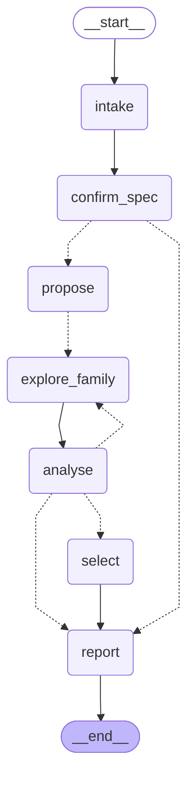

# HW Design Space Agent

[](https://github.com/BrendanJamesLynskey/HW_Design_Space_Agent/actions/workflows/ci.yml)

A **LangGraph agent for hardware design-space exploration (DSE)**. You give it a
hardware spec (function, throughput, accuracy, area/power budget); it converges on a
Pareto-optimal architecture by walking down a ladder of fidelity, from fast analytical
models to verified RTL and real synthesis.

Milestone 1 (this release) covers spec intake and analytical exploration for a
**CORDIC sin/cos unit on an Artix-7 FPGA**, plus an eval that asks the obvious question:
*why use an LLM at all?*

## The design principle

**The LLM is never the optimiser and never produces a PPA or accuracy number.**

The LLM does the architect's job: it reads the spec, chooses architecture families and
parameter ranges from a fixed registry, reads compact summaries of results, and decides
whether to refine, widen, add a family, declare the spec infeasible, or stop.
Deterministic code produces every number:

| number | produced by | provenance label |
|---|---|---|
| max-abs / RMS error, accuracy bits | bit-accurate NumPy golden model, exhaustive angle sweep (W ≤ 16) or documented dense sweep | *exact* |
| latency in cycles | the family's schedule | *exact* |
| LUTs, FFs, Fmax, throughput, latency (ns), power index | analytical cost model calibrated to Vivado results | *estimate* (with calibration id) |
| real area / Fmax / power | synthesis runs (milestone 2) | *measured* |
| the search itself | Optuna NSGA-II inside the LLM's ranges; Pareto and hypervolume maths | — |

This shows up in the types: the LLM's structured-output schemas
(`src/hw_dse/agent/schemas.py`) have fields for families, ranges, budget shares,
decisions and rationale, and no field where a number about a design could go. Every
range the LLM proposes is clamped against the registry in code, and the hard stopping
rules (round cap, budget, hypervolume-gain threshold, "infeasible" is refused while
feasible designs exist) are applied by code after each LLM decision and logged in the
report.

## Roadmap

| milestone | fidelity levels | status |
|---|---|---|
| **M1** | **L0** spec intake (NL/YAML → validated `Spec`, human confirmation) · **L1** analytical exploration (LLM-chosen families and ranges, Optuna multi-objective search over fast cost models, Pareto front) · baseline eval | **done** |
| M2 | **L3** parametrised SystemVerilog per family, checked against the golden model, formal checks on small configs · **L4** synthesis for real area/Fmax/power · **L5** back-annotation: compare against L1, recalibrate the cost model, re-explore if the winner changes | planned |
| M3 | **L2** cycle-level simulation for shortlisted candidates | planned |
| M4 | more functions and targets (e.g. an ASIC gate-equivalent `CostModel`), richer family registry | planned |

## Agent graph

Generated from the compiled graph (`hw-dse diagram`); `tests/test_diagram.py` fails if
this drifts from the code.

<!-- graph:start -->

<!-- graph:end -->

| node | who decides | what happens |
|---|---|---|
| `intake` | code (YAML) / LLM (natural language) | YAML that validates as a `Spec` is loaded directly; otherwise the LLM fills a `SpecDraft` and code converts it |
| `confirm_spec` | human | `interrupt()`: approve, edit or reject (`--auto-approve` for CI and batch runs) |
| `propose` | LLM → code | `ExplorationPlan`: families, ranges, budget shares, rationale; code clamps and budgets it |
| `explore_family` | code | one Optuna NSGA-II study per family, fanned out with `Send`; results appended by a reducer |
| `analyse` | code → LLM → code | code merges the front, feasibility, hypervolume; LLM reads a compact summary and returns `refine` / `widen` / `add_family` / `infeasible` / `stop`; code applies the stopping rules |
| `select` | human / code | `interrupt()` to pick a design off the front, or auto-select by the spec's rule |
| `report` | code | `runs/<spec>/<timestamp>/`: `report.md`, `pareto.png`, `evaluations.csv`, `llm_trace.jsonl` |

State is checkpointed with LangGraph's `SqliteSaver`, so a run paused for human input,
or killed, resumes from its last completed step (`hw-dse resume`).

## The M1 design space: CORDIC sin/cos

The reference implementation is
[BrendanJamesLynskey/CORDIC](https://github.com/BrendanJamesLynskey/CORDIC)
(`cordic_rotation_iterative.sv`, `cordic_rotation_pipelined.sv`; 16-bit data,
14 iterations, quadrant pre-rotation, gain pre-compensation).

**Families** (`src/hw_dse/families.py`): the LLM can only choose from these.

| family | schedule | results / cycle | latency |
|---|---|---|---|
| `iterative` | 1 micro-rotation per cycle, barrel shifters, FSM (reference) | 1/(N+3) | N+3 |
| `unrolled_k` | k chained micro-rotations per cycle | 1/(⌈N/k⌉+3) | ⌈N/k⌉+3 |
| `pipelined` | one registered stage per micro-rotation (reference) | 1 | N+2 |
| `pipelined_m` | a register every m stages | 1 | ⌈N/m⌉+2 |

**Parameters**: data width W (8–28), iterations N (4–30), angle-path width
A = W + angle_guard (angle_guard −2…+4), fractional guard bits on x/y (0–4),
truncation vs round-half-up, plus k or m (2–8). That is 39,690 numeric
configurations and 635,040 designs in total, small enough to enumerate for the eval.

### Golden model: bit-exact against the RTL

`src/hw_dse/models/cordic_bitexact.py` is a vectorised NumPy model of the datapath.
For the reference configuration it is **bit-exact on all 65,536 input angles** against
Icarus Verilog simulations of both reference modules (`rtl_harness/tb_bitexact.sv`,
`tests/test_bitexact_rtl.py`; CI installs Icarus and fetches the RTL at a pinned commit).
Accuracy is measured over every angle for W ≤ 16, and over 131,072 angles (2¹⁶ strided
plus 2¹⁶ seeded-random) above that. In the dense case the max error is exact for those
angles, so it is a lower bound on the true worst case.

The reference design's exact error is 10.5 LSB max / 2.26 LSB RMS (≈ 2⁻¹⁰·⁶), dominated
by truncation in the x/y shifts. Fractional guard bits fix that. A wider angle path then
fixes the atan-LUT quantisation that takes over. Neither helps much alone.

### Cost model: calibrated, but weakly

`src/hw_dse/models/cost_fpga.py` counts structure (adder bits, barrel-shifter mux trees,
ROM bits, registers, LUT/mux levels and CARRY4 chains on the critical path) and converts
it to Artix-7 LUTs, FFs and Fmax. The primitive delays are read off the Vivado timing
reports. Five free constants are solved from the two anchors in the CORDIC repo
(Vivado 2025.2, xc7a35tcpg236-1). They live with their sources in
`src/hw_dse/models/calibration_artix7.yaml`.

| anchor | LUTs (model / Vivado) | FFs (model / Vivado) | Fmax MHz (model / Vivado) |
|---|---|---|---|
| iterative, W=16, N=14 | 170.0 / 170 | 95.8 / 95 | 198.3 / 198.3 |
| pipelined, W=16, N=14 | 745.0 / 745 | 776.9 / 784 | 272.9 / 272.9 |

**Two anchor points is a weak calibration.** It pins the model at the defaults and makes
it plausible elsewhere, but everything away from W=16/N=14, and both families with no
anchor at all (`unrolled_k`, `pipelined_m`), is an extrapolation. Milestone 2 adds real
synthesis runs across the space and recalibrates. Throughput = Fmax × results per cycle.
The **power index** is (LUTs + FFs) × operating clock × activity, normalised to the
reference iterative design at 100 MHz. It is a relative ranking aid, never watts.

## Quick start

```bash
git clone https://github.com/BrendanJamesLynskey/HW_Design_Space_Agent.git
cd HW_Design_Space_Agent
python -m venv .venv && . .venv/bin/activate
pip install -e '.[dev,openrouter]'      # extras: openai, anthropic, gemini, ollama

pytest                                   # ~15 s, offline, fake LLM only

# Offline demo with the rule-based fake architect (not an LLM):
hw-dse run --spec specs/dds_250msps.yaml --provider fake --auto-approve --auto-select

# With a real model (see .env.example):
export OPENROUTER_API_KEY=...            # or put it in .env (git-ignored)
hw-dse ping --provider openrouter --model anthropic/claude-sonnet-5.5
hw-dse run  --spec specs/dds_250msps.yaml --provider openrouter --model anthropic/claude-sonnet-5.5

# Interactive human-in-the-loop: without --auto-* the run pauses for spec
# confirmation and design selection; on a non-TTY it exits and you resume:
hw-dse resume --thread-id <id> --approve
hw-dse resume --thread-id <id> --choice 3      # or --choice auto
```

To run the RTL comparison locally, install Icarus (`apt install iverilog`) and run
`scripts/fetch_reference_rtl.sh`.

**Example specs** (`specs/`) lead to different winners on the exhaustive ground truth:

| spec | constraints | objectives | true winner (spec's selection rule) |
|---|---|---|---|
| `dds_250msps` | ≥ 250 MSPS, error ≤ 2⁻¹³ | min LUTs, max accuracy bits | `pipelined` W=18 N=15 |
| `low_area_control` | ≥ 1 MSPS, error ≤ 2⁻¹⁰ | min LUTs+FFs, max accuracy bits | `iterative` W=15 N=12 |
| `high_precision` | ≥ 50 MSPS, error ≤ 2⁻²⁰ | min LUTs+FFs, min power index | `pipelined_m` W=26 N=22 m=6 |
| `infeasible_dds_400msps` | ≥ 400 MSPS, error ≤ 2⁻¹² | min LUTs, max accuracy bits | **none**: nothing in the registry exceeds 291.5 MSPS under the cost model |

## Worked example

*Pending: a real-LLM run will be added to `docs/example_run/` when the live eval completes.*

## Eval: why use an LLM at all?

See [`eval/results.md`](eval/results.md). *Agent results pending (live runs in progress); ground truth and baselines are complete.*

## Limitations

- **Cost model fidelity.** Two anchors, five fitted constants; LUT counts and Fmax for
  `unrolled_k` and `pipelined_m`, and for any width far from 16, are extrapolations. The
  Fmax model uses Vivado's post-synthesis (unplaced) delay estimates, which are
  optimistic compared with routed timing. Rankings between families should be more
  trustworthy than absolute numbers. M2's measured data is the fix.
- **Power index** is resource-count × clock × a fixed activity factor. It ignores
  glitching, clock-tree and static power and real toggle rates. It is useful for ranking
  only.
- **`unrolled_k` never reaches any front** under this model: chaining k stages
  lengthens the critical path roughly k-fold, and the 3 FSM overhead cycles remain. This
  may be a model artefact that synthesis data in M2 will test.
- **Dense accuracy sweeps (W > 16)** give exact errors on 131,072 angles, which is a
  lower bound on the true worst case rather than a proof.
- **Single-lane designs only**: no multi-lane / polyphase architectures, so the 400 MSPS
  spec is infeasible by construction of the registry.
- **Evaluation counting** treats every Optuna trial as one evaluation, including repeats
  of an already-seen design, for agent and baselines alike.
- **LLM variance**: three seeds per spec and model is a small sample. Treat
  differences of a few percent as noise.

## Repository layout

```
src/hw_dse/
  models/cordic_bitexact.py    bit-accurate golden model (exact)
  models/rtl_reference.py      Icarus runner for the reference RTL
  models/cost_base.py          CostModel protocol (target-agnostic)
  models/cost_fpga.py          Artix-7 structural cost model (estimate)
  models/calibration_artix7.yaml  anchors, primitive delays, fitted constants
  families.py                  architecture registry + range clamping
  spec.py                      Spec schema (constraints, objectives, budget)
  evaluate.py                  one design -> all metrics with provenance
  pareto.py                    dominance, exact hypervolume
  explore.py                   Optuna NSGA-II / random studies, grid enumeration
  accuracy_table.py            precomputed exact accuracy for the whole registry
  benchmark.py                 exhaustive ground truth, baselines, run scoring
  agent/                       LangGraph agent: graph, schemas, prompts, LLM factory,
                               summariser, tracer, report writer, runner
  cli.py                       hw-dse run | resume | ping | diagram
specs/                         example specs (YAML)
eval/run_eval.py               ground truth, baselines, live agent runs, results.md
rtl_harness/tb_bitexact.sv     stimulus/capture harness for the RTL comparison
tests/                         offline pytest suite (fake LLM only)
docs/example_run/              a real-LLM run, copied from runs/
```

## Licence

MIT.
