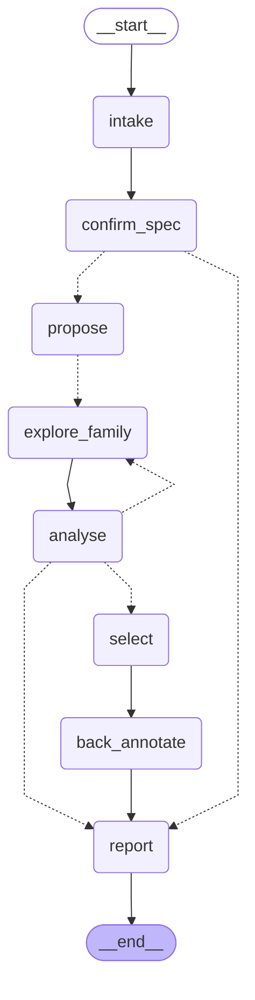
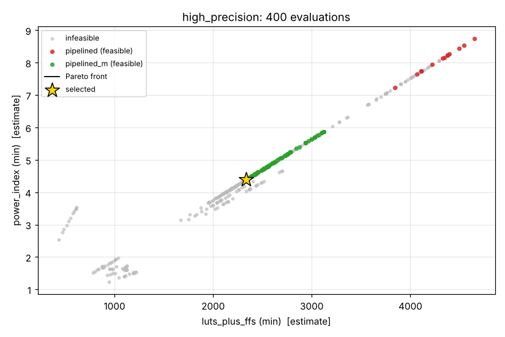

# HW Design Space Agent

[](https://github.com/BrendanJamesLynskey/HW_Design_Space_Agent/actions/workflows/ci.yml)

A **LangGraph agent for hardware design-space exploration (DSE)**. You give it a
hardware spec (function, throughput, accuracy, area/power budget); it converges on a
Pareto-optimal architecture by walking down a ladder of fidelity, from fast analytical
models to verified RTL and real synthesis.

The running example is a **CORDIC sin/cos unit on an Artix-7 FPGA**. Milestone 1 built
spec intake, analytical exploration and an eval that asks the obvious question: *why use
an LLM at all?* **Milestone 2 (this release)** climbs the rest of the ladder: a generator
that turns any explored design into verified SystemVerilog (simulated in two simulators
against the golden model, formally checked, simulated again at gate level after
synthesis), open-source synthesis and place-and-route on the anchors' Artix-7 part, a
back-annotation path that refits the cost model to measured data, and an agent that maps
the whole trade-off curve instead of only the corner its selection rule cares about,
re-evaluated over five seeds.

**Showcase site:** [hw-design-space-agent.vercel.app](https://hw-design-space-agent.vercel.app/)
([source](https://github.com/BrendanJamesLynskey/hw-design-space-agent)) presents this
project with animations driven by this repository's recorded runs and models: the graph
replayed from the eval traces, Pareto replays, the hypervolume race against the baselines,
and the LLM cost per run.

## The design principle

**The LLM is never the optimiser and never produces a PPA or accuracy number.**

The LLM does the architect's job: it reads the spec, chooses architecture families and
parameter ranges from a fixed registry, reads compact summaries of results, and decides
whether to refine, widen, add a family, declare the spec infeasible, or stop.
Deterministic code produces every number:

| number | produced by | provenance label |
|---|---|---|
| max-abs / RMS error, accuracy bits | bit-accurate NumPy golden model, exhaustive angle sweep (W ≤ 16) or documented dense sweep | *exact* |
| latency in cycles | the family's schedule | *exact* |
| LUTs, FFs, Fmax, throughput, latency (ns), power index | analytical cost model calibrated to Vivado results | *estimate* (with calibration id) |
| RTL correctness: output codes and latency of generated SystemVerilog, before and after synthesis | Verilator and Icarus simulations compared with the golden model, angle by angle; SymbiYosys proofs | *exact* |
| LUTs, FFs, CARRY4s, post-route Fmax | Yosys + nextpnr-xilinx on xc7a35tcpg236-1 (Vivado points to follow) | *measured (tool, version)* |
| refitted cost-model constants, per-tool correction factors | least squares over measured points | *estimate* naming the refit calibration |
| the search itself | Optuna NSGA-II inside the LLM's ranges, plus code-driven front-mapping rounds; Pareto and hypervolume maths | — |

This shows up in the types: the LLM's structured-output schemas
(`src/hw_dse/agent/schemas.py`) have fields for families, ranges, budget shares,
decisions and rationale, and no field where a number about a design could go. Every
range the LLM proposes is clamped against the registry in code, and the hard stopping
rules (round cap, budget, hypervolume-gain threshold, "infeasible" is refused while
feasible designs exist) are applied by code after each LLM decision and logged in the
report.

## Roadmap

| milestone | fidelity levels | status |
|---|---|---|
| **M1** | **L0** spec intake (NL/YAML → validated `Spec`, human confirmation) · **L1** analytical exploration (LLM-chosen families and ranges, Optuna multi-objective search over fast cost models, Pareto front) · baseline eval | **done** |
| **M2** | **L3** SystemVerilog generator for every family, verified against the golden model (Verilator + Icarus, exhaustive for W ≤ 16), SymbiYosys proofs (W = 8) · **L4** open-source synthesis + place-and-route (Yosys + nextpnr-xilinx), gate-level simulation of the netlist · **L5** measured-points schema, per-tool refit of the cost model, back-annotation node that flags a winner change · whole-curve agent levers · 5-seed eval | **done** |
| M2 follow-ups | Vivado 2025.2 on the six recommended points (a separate PR: one command feeds them into the refit) · re-explore automatically when back-annotation flags a winner change (today it reports) · measured power | planned |
| M3 | **L2** cycle-level simulation for shortlisted candidates | planned |
| M4 | more functions and targets (e.g. an ASIC gate-equivalent `CostModel`), richer family registry | planned |

## The fidelity ladder

| level | what | where | status |
|---|---|---|---|
| L0 | spec intake: YAML or natural language → validated `Spec`, human confirmation | `spec.py`, `intake` node | done (M1) |
| L1 | analytical exploration: golden-model accuracy (*exact*) + cost model (*estimate*), NSGA-II inside LLM-chosen boxes | `models/`, `explore.py`, agent | done (M1); front-mapping levers (M2) |
| L2 | cycle-level / system simulation | — | planned (M3) |
| L3 | parametrised SystemVerilog per family; Verilator + Icarus vs golden model; SymbiYosys | `rtl/`, `rtl_golden/`, `formal/` | **done (M2)**: 47 configurations × 2 simulators, 0 mismatches; 7 proofs |
| L4 | synthesis + place-and-route; gate-level simulation of the netlist | `synth/flow.py`, `synth/gatesim.py` | **done (M2)** with Yosys 0.68 + nextpnr-xilinx: 39 measured points; 22 gate-level runs, 0 mismatches. Vivado: planned |
| L5 | back-annotation: measured vs estimate, refit per tool, flag winner changes | `synth/recalibrate.py`, `back_annotate` node | **done (M2)** for comparison, refit and flagging; automatic re-exploration planned |

## Agent graph

Generated from the compiled graph (`hw-dse diagram`); `tests/test_diagram.py` fails if
this drifts from the code.

<!-- graph:start -->

<!-- graph:end -->

| node | who decides | what happens |
|---|---|---|
| `intake` | code (YAML) / LLM (natural language) | YAML that validates as a `Spec` is loaded directly; otherwise the LLM fills a `SpecDraft` and code converts it |
| `confirm_spec` | human | `interrupt()`: approve, edit or reject (`--auto-approve` for CI and batch runs) |
| `propose` | LLM → code | `ExplorationPlan`: families, ranges, budget shares, rationale; code clamps and budgets it |
| `explore_family` | code | one Optuna NSGA-II study per family, fanned out with `Send`; results appended by a reducer |
| `analyse` | code → LLM → code | code merges the front, feasibility, hypervolume; LLM reads a compact summary and returns `refine` / `widen` / `add_family` / `map_front` / `infeasible` / `stop`; code applies the stopping rules and the whole-curve levers (below) |
| `select` | human / code | `interrupt()` to pick a design off the front, or auto-select by the spec's rule |
| `back_annotate` | code | L5: measured data for the selected design (committed L4 CSV, or a fresh synthesis if configured) vs its estimates; front designs with measurements re-scored on the Vivado scale; flags a winner change in the report |
| `report` | code | `runs/<spec>/<timestamp>/`: `report.md`, `pareto.png`, `evaluations.csv`, `llm_trace.jsonl` |

State is checkpointed with LangGraph's `SqliteSaver`, so a run paused for human input,
or killed, resumes from its last completed step (`hw-dse resume`).

### Whole-curve levers (M2)

M1's agent was a better *selector* than NSGA-II but a worse *front-mapper*: it dived at
the corner the spec's selection rule picks, and the 1% HV-gain rule then ended the run
with a narrow front. M2 adds deterministic levers in `src/hw_dse/agent/graph.py`
(`LEVERS_M2`); the LLM can only *choose* one of them:

* **coverage reserve (40%)**: once a feasible design exists, the LLM's own rounds may
  spend at most 60% of the budget. Whenever the run would stop (the LLM says `stop`, the
  HV-gain rule fires, the round cap or the LLM's share is reached) with feasible designs
  and budget left, code spends what is left on one **front-mapping round** and stops
  without another LLM call. While nothing is feasible the LLM keeps the whole budget, so
  infeasibility is still established properly.
* **front-mapping round**: NSGA-II per family on the merged front, over the registry's
  full ranges with `data_width`/`n_iter` starting just below the front (the
  "front-anchored" box).
* **`map_front`**: a new decision the LLM can take in `analyse` to run such a round
  itself; its summary now says how much of each objective the front covers.

They were tuned **offline, without spending anything**: `ReplayArchitect` replays the
decisions the M1 LLMs actually made (from the committed traces) into today's graph.
With the levers off it reproduces every recorded M1 score exactly; with them on, over the
12 recorded runs per spec, mean HV rose from 0.43 to 0.90 (`dds_250msps`) and 0.20 to
0.90 (`low_area_control`) with selection regret no worse (`eval/tune_levers.py`,
`eval/data/levers_offline*.json`, three rounds: reserve size, box, warm starts, slack). A
replay holds the LLM's decisions fixed, so the live 5-seed eval below is the real test.

## The M1 design space: CORDIC sin/cos

The reference implementation is
[BrendanJamesLynskey/CORDIC](https://github.com/BrendanJamesLynskey/CORDIC)
(`cordic_rotation_iterative.sv`, `cordic_rotation_pipelined.sv`; 16-bit data,
14 iterations, quadrant pre-rotation, gain pre-compensation).

**Families** (`src/hw_dse/families.py`): the LLM can only choose from these.

| family | schedule | results / cycle | latency |
|---|---|---|---|
| `iterative` | 1 micro-rotation per cycle, barrel shifters, FSM (reference) | 1/(N+3) | N+3 |
| `unrolled_k` | k chained micro-rotations per cycle | 1/(⌈N/k⌉+3) | ⌈N/k⌉+3 |
| `pipelined` | one registered stage per micro-rotation (reference) | 1 | N+2 |
| `pipelined_m` | a register every m stages | 1 | ⌈N/m⌉+2 |

**Parameters**: data width W (8–28), iterations N (4–30), angle-path width
A = W + angle_guard (angle_guard −2…+4), fractional guard bits on x/y (0–4),
truncation vs round-half-up, plus k or m (2–8). That is 39,690 numeric
configurations and 635,040 designs in total, small enough to enumerate for the eval.

### Golden model: bit-exact against the RTL

`src/hw_dse/models/cordic_bitexact.py` is a vectorised NumPy model of the datapath.
For the reference configuration it is **bit-exact on all 65,536 input angles** against
Icarus Verilog simulations of both reference modules (`rtl_harness/tb_bitexact.sv`,
`tests/test_bitexact_rtl.py`; the RTL is vendored at a pinned commit and CI installs Icarus).
Accuracy is measured over every angle for W ≤ 16, and over 131,072 angles (2¹⁶ strided
plus 2¹⁶ seeded-random) above that. In the dense case the max error is exact for those
angles, so it is a lower bound on the true worst case.

The reference design's exact error is 10.5 LSB max / 2.26 LSB RMS (≈ 2⁻¹⁰·⁶), dominated
by truncation in the x/y shifts. Fractional guard bits fix that. A wider angle path then
fixes the atan-LUT quantisation that takes over. Neither helps much alone.

### Cost model: calibrated, but weakly

`src/hw_dse/models/cost_fpga.py` counts structure (adder bits, barrel-shifter mux trees,
ROM bits, registers, LUT/mux levels and CARRY4 chains on the critical path) and converts
it to Artix-7 LUTs, FFs and Fmax. The primitive delays are read off the Vivado timing
reports. Five free constants are solved from the two anchors in the CORDIC repo
(Vivado 2025.2, xc7a35tcpg236-1). They live with their sources in
`src/hw_dse/models/calibration_artix7.yaml`.

| anchor | LUTs (model / Vivado) | FFs (model / Vivado) | Fmax MHz (model / Vivado) |
|---|---|---|---|
| iterative, W=16, N=14 | 170.0 / 170 | 95.8 / 95 | 198.3 / 198.3 |
| pipelined, W=16, N=14 | 745.0 / 745 | 776.9 / 784 | 272.9 / 272.9 |

**Two anchor points is a weak calibration.** It pins the model at the defaults and makes
it plausible elsewhere, but everything away from W=16/N=14, and both families with no
anchor at all (`unrolled_k`, `pipelined_m`), is an extrapolation. M2 measures how far off
it is (L4) and refits it (L5), below; the eval still uses this calibration so M1 and M2
are scored on the same ground truth. Throughput = Fmax × results per cycle.
The **power index** is (LUTs + FFs) × operating clock × activity, normalised to the
reference iterative design at 100 MHz. It is a relative ranking aid, never watts.

## L3: RTL generator and verification (M2)

`src/hw_dse/rtl/generator.py` turns any `ArchConfig` into one synthesisable
SystemVerilog module. All four families come from one generator (`iterative` is
`unrolled_k` with k=1, `pipelined` is `pipelined_m` with m=1), honouring every knob of
the golden model (W, N, angle width, fractional guard bits, trunc/round):

* the atan LUT and the gain constant are produced by **the golden model's own functions**
  (`atan_lut`, `init_x`), never a second copy;
* each add/subtract is one adder with an XOR-ed operand, and round-half-up shifts reuse its
  **carry-in** (`(v + 2^(i-1)) >>> i == (v >>> i) + v[i-1]`), so rounding costs one XOR;
* uniform ports: `clk, rst, valid_in, ready, theta_in, valid_out, cos_out, sin_out`.

| family | latency (cycles, `valid_in` sampled → `valid_out`) | results |
|---|---|---|
| `iterative` | N + 3 | one every N + 3 cycles (`ready` low while busy) |
| `unrolled_k` | ⌈N/k⌉ + 3 | one every ⌈N/k⌉ + 3 cycles |
| `pipelined` | N + 2 | one per cycle (`ready` tied high) |
| `pipelined_m` | ⌈N/m⌉ + 2 | one per cycle |

Generated RTL goes to `build/`; one **golden example per family** is committed in
`rtl_golden/` and a test regenerates and diffs it. All committed examples, and 300 random
registry designs, are `verilator --lint-only -Wall` clean.

**Verification** (`src/hw_dse/rtl/sim.py`, `rtl_harness/tb_generated.sv`; table:
`eval/data/l3_verification.csv`): one harness drives every family in **Verilator 5.020**
and **Icarus 12**, and every output code is compared with `cordic_sincos()`. All 2^W
angles for W ≤ 16, the documented dense set (131,072 codes) above. The measured latency of
every result is checked against the documented one.

| check | configurations | result |
|---|---|---|
| generated RTL, Verilator + Icarus | 47 (every family at W ∈ {8, 12, 16, 24}, N from 4 to 30, k, m ∈ {2, 3, 4, 8}, both rounding modes, angle guard −2…+2, guard bits 0…4, the three ground-truth winners) × 2 simulators | **0 mismatches** in 94 runs, latency as documented everywhere |
| generated vs vendored reference RTL (W=16, N=14, `iterative` and `pipelined`) | all 65,536 angles | **bit-identical outputs** |
| gate level: Yosys-mapped netlist + `cells_sim.v` (zero-delay) | every family exhaustively at W=8 (both rounding modes, both simulators) and at W=16 (Verilator; Icarus for the pipelined families) | **0 mismatches** in 22 runs |
| SymbiYosys, k-induction (`formal/`, `eval/data/formal_results.csv`) | `pipelined_m` ≡ `pipelined` after latency alignment (m = 2, 3, 4; trunc and round); valid/ready/latency properties for every family; all W = 8 | **7/7 proved**; two mutation tests (latency off by one, rounding mismatch) must and do fail, so the properties are not vacuous |

## L4: open-source synthesis on Artix-7 (M2)

`src/hw_dse/synth/flow.py` runs **Yosys 0.68** (`synth_xilinx -flatten -abc9`) and
**nextpnr-xilinx 0.8.2-81-g1743d0f4** (openXC7, prjxray-db timing) on **xc7a35tcpg236-1**,
the anchors' part, at the anchors' 10 ns constraint. LUT/FF/CARRY4 counts come from
Yosys, Fmax is nextpnr's **post-route** figure (median of three placement seeds). Every
row of `eval/data/l4_synthesis.csv` is labelled *measured (tool, version)* and carries its
exact command line; logs are in `eval/data/l4_logs/`, details in `eval/data/README.md`.

39 points: the two Vivado anchors as the **vendored reference RTL** and as **generated
RTL**, the six points for the coming Vivado runs, the three ground-truth winners and a
spread over every family. Selected rows, measured vs the M1 cost model (*estimate*):

| design (W=16, N=14 unless noted) | RTL | LUTs meas / est | FFs meas / est | Fmax MHz meas / est |
|---|---|---|---|---|
| `iterative` (Vivado anchor: 170 / 95 / 198.3) | reference | 296 / 170 | 111 / 96 | 118.6 / 198.3 |
| `pipelined` (Vivado anchor: 745 / 784 / 272.9) | reference | 1115 / 745 | 769 / 777 | 171.8 / 272.9 |
| `iterative` | generated | 225 / 170 | 111 / 96 | 157.2 / 198.3 |
| `pipelined` | generated | 727 / 745 | 753 / 777 | 195.7 / 272.9 |
| `unrolled_k` k=2 / k=4 | generated | 269 / 253, 498 / 352 | 96 / 95, 96 / 94 | 90.7 / 105.4, 52.5 / 72.1 |
| `pipelined_m` m=2 / m=4 | generated | 719 / 745, 695 / 745 | 417 / 421, 252 / 254 | 120.5 / 171.0, 63.9 / 97.8 |
| `pipelined` W=12 / W=24 | generated | 537 / 581, 1094 / 1074 | 561 / 607, 1081 / 1116 | 191.3 / 281.9, 163.0 / 256.5 |

What the data says:

* **Same RTL, different tools.** On the identical reference RTL, Yosys maps 1.74× / 1.50×
  the LUTs Vivado reports, and nextpnr's post-route Fmax is 0.60× / 0.63× Vivado's
  post-*synthesis* estimate. These are different measurements (mapper, LUT accounting,
  routed vs unplaced timing), not errors in either.
* **The generator's RTL synthesises smaller and faster** than the reference in Yosys
  (−24% / −35% LUTs), mainly because each micro-rotation is one add/sub with a carry-in
  rather than two adders and a mux.
* **Across all 37 generated points** the M1 model's error vs Yosys/nextpnr is 16% RMS
  (LUTs), 7% (FFs) and 44% (Fmax: almost all of it the tools' different timing scale).
* **`unrolled_k` is genuinely dominated, not a cost-model artefact.** k=2 costs more LUTs
  than `iterative` and its two chained rotations halve the clock, so throughput does not
  improve (90.7 MHz / 10 cycles ≈ 9.1 MSPS vs 157.2 MHz / 17 cycles ≈ 9.2 MSPS).

Fallback (not needed here; documented for other machines): `--yosys-only` gives resource
counts with **no Fmax** when nextpnr-xilinx is unavailable.

## L5: back-annotation (M2)

* **One schema for measured points from any tool** (`src/hw_dse/synth/measured.py`:
  tool, version, part, RTL source, family, parameters, LUT, FF, CARRY4, Fmax, how Fmax was
  obtained, command, source log), validated on load.
* **Refit** (`python -m hw_dse.synth.recalibrate --measured <csv>... --name <name>`): the
  cost model's constants are refitted by relative least squares, pooled first and then
  **per family** where a family has ≥ 5 points, with **one correction factor per tool and
  metric** (Vivado = 1, so constants stay on the Vivado scale and open-source data informs
  the *shape*). It writes a **new named calibration** next to the default one, residuals
  at every measured point before and after, and the ground truth recomputed under the new
  calibration: does each spec's winner change, which families reach a front.
* **Open-source refit** (`eval/data/l5_refit_yosys-nextpnr.md`): RMS error vs Yosys/nextpnr
  on the 37 generated points drops from 16.0 / 7.1 / 43.5% (LUT / FF / Fmax, M1 model
  as-is) to **9.0 / 2.5 / 9.2%**. Fitted tool factors: LUT ×1.13, FF ×1.06, critical path
  ×1.50 relative to the Vivado scale. Under the refit **no spec's winner changes**, and
  `unrolled_k` still reaches **no** Pareto front.
* **The default cost model for the eval is unchanged** (the M1 two-anchor Vivado
  calibration), so the M2 eval is comparable with M1 and the ground truth does not move.
  The refit calibration is available as `FpgaCostModel("src/hw_dse/models/calibration_artix7_refit_yosys-nextpnr.yaml")`.
* **In the agent**: the `back_annotate` node compares the selected design's estimates
  with measured data and flags a winner change (selected design infeasible when measured,
  or the selection rule prefers another measured front design). It runs on recorded CSVs
  offline, or synthesises the selected design if configured (`back_annotate: {synthesize: true}`).

### Feeding in Vivado results

```bash
python scripts/vivado_points.py export --out vivado_points     # 8 designs + the anchors' Vivado TCL flow
(cd vivado_points && ./run_all.sh)                              # on a machine with Vivado 2025.2
python scripts/vivado_points.py collect --dir vivado_points --out eval/data/vivado_measured.csv
python -m hw_dse.synth.recalibrate --measured eval/data/vivado_measured.csv \
       --measured eval/data/l4_synthesis.csv --name vivado-2025.2
```

The last command writes `calibration_artix7_refit_vivado-2025.2.yaml` (the default stays
untouched), residuals at every point before and after, and whether each spec's
ground-truth winner changes (`eval/data/l5_refit_vivado-2025.2.md`). The eight designs are
the six points above plus the two *generated* anchors, which test the assumption that
Vivado treats generated and reference RTL alike. Any CSV in the measured-points schema
works too.

## Quick start

```bash
git clone https://github.com/BrendanJamesLynskey/HW_Design_Space_Agent.git
cd HW_Design_Space_Agent
python -m venv .venv && . .venv/bin/activate
pip install -e '.[dev,openrouter]'      # extras: openai, anthropic, gemini, ollama

pytest                                   # < 60 s, offline, no LLM; tool tests skip if tools are absent

# Offline demo with the rule-based fake architect (not an LLM):
hw-dse run --spec specs/dds_250msps.yaml --provider fake --auto-approve --auto-select

# With a real model (see .env.example):
export OPENROUTER_API_KEY=...            # or put it in .env (git-ignored)
hw-dse ping --provider openrouter --model anthropic/claude-sonnet-5.5
hw-dse run  --spec specs/dds_250msps.yaml --provider openrouter --model anthropic/claude-sonnet-5.5

# Interactive human-in-the-loop: without --auto-* the run pauses for spec
# confirmation and design selection; on a non-TTY it exits and you resume:
hw-dse resume --thread-id <id> --approve
hw-dse resume --thread-id <id> --choice 3      # or --choice auto
```

**EDA tools** (optional locally; each class of test skips cleanly without them, and CI
requires them through `HW_DSE_REQUIRE_RTL/SIM/FORMAL/GATE/SYNTH=1`):

```bash
# simulation, formal, Yosys (Ubuntu 24.04 packages)
sudo apt install iverilog verilator yosys z3
git clone https://github.com/YosysHQ/sby && sudo make -C sby install   # SymbiYosys
pip install click                                                       # needed by sby

python scripts/run_l3_sweep.py          # L3: every config, both simulators -> eval/data/l3_verification.csv
python -m hw_dse.rtl.formal             # SymbiYosys proofs -> eval/data/formal_results.csv
HW_DSE_L3_FULL=1 pytest tests/test_rtl_generator.py tests/test_formal.py

# synthesis + place-and-route (openXC7 in a container; Yosys alone also works natively)
docker pull regymm/openxc7
scripts/build_chipdb.sh build/chipdb && export HW_DSE_CHIPDB_DIR=build/chipdb
python scripts/run_l4_sweep.py          # L4 -> eval/data/l4_synthesis.csv (--yosys-only: no Fmax)
python scripts/run_gate_sim.py          # gate-level rows of l3_verification.csv
python -m hw_dse.synth.recalibrate --measured eval/data/l4_synthesis.csv --name yosys-nextpnr   # L5
python scripts/worked_example.py        # docs/worked_example_m2.md
```

The reference RTL is vendored in `third_party/CORDIC/` (MIT, pinned commit `fe4775e`,
SHA-256 of every file in `VENDORED.md`, checked by `scripts/check_vendored.py`).

**Example specs** (`specs/`) lead to different winners on the exhaustive ground truth:

| spec | constraints | objectives | true winner (spec's selection rule) |
|---|---|---|---|
| `dds_250msps` | ≥ 250 MSPS, error ≤ 2⁻¹³ | min LUTs, max accuracy bits | `pipelined` W=18 N=15 |
| `low_area_control` | ≥ 1 MSPS, error ≤ 2⁻¹⁰ | min LUTs+FFs, max accuracy bits | `iterative` W=15 N=12 |
| `high_precision` | ≥ 50 MSPS, error ≤ 2⁻²⁰ | min LUTs+FFs, min power index | `pipelined_m` W=26 N=22 m=6 |
| `infeasible_dds_400msps` | ≥ 400 MSPS, error ≤ 2⁻¹² | min LUTs, max accuracy bits | **none**: nothing in the registry exceeds 291.5 MSPS under the cost model |

## Worked example: one design up the ladder (M2)

[`docs/worked_example_m2.md`](docs/worked_example_m2.md) (regenerate with
`python scripts/worked_example.py`) takes the exhaustive ground truth's winner for
`low_area_control`, `iterative` W=15 N=12 angle_guard=1 round, through every rung:

| rung | result | provenance |
|---|---|---|
| L1 | 158.8 LUTs, 91.8 FFs, 198.3 MHz → 13.2 MSPS; max error 9.17e-4 = 2^-10.09 | *estimate* (M1 calibration); *exact* (all 32,768 angles) |
| L3 RTL | `cordic_iterative_w15_n12_ap1_g0_round`: 0 mismatches on 32,768 angles in Verilator and in Icarus, latency 15 = N+3 | *exact* |
| gate level | Yosys netlist (216 LUT, 107 FF, 22 CARRY4 cells): 0 mismatches, latency 15 | *exact* |
| L4 | 216 LUTs, 107 FFs, 150.7 MHz post-route (median of 144.7 / 150.7 / 156.2) | *measured (Yosys 0.68 + nextpnr-xilinx 0.8.2-81)* |
| L1 vs L4 | LUTs −26.5%, FFs −14.2%, Fmax +31.6% (estimate vs measured) | |
| L5 | refit × tool factor: 198.5 LUTs (−8.1%), 103.9 FFs (−2.9%), 151.3 MHz (+0.4%); `back_annotate`: winner unchanged; measured throughput 10.0 MSPS still meets ≥ 1 MSPS | *estimate* (refit calibration) |

## Worked example (real LLM run, M1)

[`docs/example_run/`](docs/example_run/report.md) is a complete run with **Claude Sonnet 5.5 via OpenRouter**
on `high_precision` (seed 0), copied from `runs/eval/`: report, Pareto plot, evaluations CSV and the full LLM
trace. Rounds as the architect played them:

1. **propose**: rules out `iterative`/`unrolled_k`, reasoning that ~20+ iterations at N+3 cycles per result cannot
   reach 50 MSPS. Splits 100 evaluations 2:1 between `pipelined_m` (fewer registers, so less area and power) and
   `pipelined` (as a reference). Code finds 31 feasible designs.
2. **add_family**: the front is one `pipelined_m` point at 59.9 MSPS. Throughput has headroom, so it spends a
   small share testing whether a multi-cycle family can scrape 50 MSPS. Code: they top out at 6.6 MSPS.
3. **refine, refine**: narrows W, N and m around the winning corner, with hypervolume still rising (+1.2%).
4. **stop**: at the round cap, with +0.0% hypervolume gain.

Selected: `pipelined_m` W=26, N=22, angle_guard=1, frac_guard=1, trunc, m=7, at 1930 LUTs / 406 FFs / 52.0 MSPS
(*estimates*) with max error 7.83e-07 = 2^-20.28 (*exact*). That is 3.4% more LUTs+FFs than the true optimum
from the exhaustive grid. Every number in the report was computed by code; the LLM's contribution is the quoted
plans and rationale.




## Eval: why use an LLM at all? (M1 vs M2)

Full tables: [`eval/results.md`](eval/results.md) (`python eval/run_eval.py report`
regenerates it from the committed data with no diff; CI checks that). Same budget for
every method (400 evaluations per spec), all scored against the exhaustive ground truth
(635,040 designs) under the **unchanged M1 cost model**, so the two milestones are
comparable. **M1**: 3 seeds, the M1 agent. **M2**: 5 seeds, the agent with the
whole-curve levers; baselines re-run at 5 seeds (seeds 0–2 reproduce M1's exactly). The
agent columns come only from **real OpenRouter runs**: `anthropic/claude-sonnet-5.5`,
`deepseek/deepseek-v4.1-flash` and `qwen/qwen3.8-27b` with reasoning off. All three were
re-confirmed in `/api/v1/models` with `tools` and `structured_outputs` before use. Cells
are mean ± population std over seeds.

**Hypervolume fraction at the end of the run** (M1 → M2)

| spec | NSGA-II | random | Sonnet 5.5 | DeepSeek V4.1 Flash | Qwen3.8-27B, reasoning off |
|---|---|---|---|---|---|
| dds_250msps | 0.800 → 0.826 ± 0.034 | 0.752 → 0.758 ± 0.059 | 0.256 → **0.839 ± 0.079** | 0.695 → **0.897 ± 0.048** | 0.369 → **0.898 ± 0.036** |
| low_area_control | 0.905 → 0.898 ± 0.032 | 0.856 → 0.862 ± 0.054 | 0.207 → **0.876 ± 0.025** | 0.202 → **0.919 ± 0.044** | 0.164 → **0.889 ± 0.011** |
| high_precision | 0.920 → 0.934 ± 0.056 | 0.880 → 0.798 ± 0.105 | 0.979 → **0.975 ± 0.004** | 0.961 → **0.982 ± 0.012** | 0.951 → **0.895 ± 0.159** |

**Agent HV relative to NSGA-II** on the same milestone's seeds (1.00 = parity)

| spec | Sonnet 5.5 | DeepSeek V4.1 Flash | Qwen3.8-27B, reasoning off |
|---|---|---|---|
| dds_250msps | 0.32 → **1.02** | 0.87 → **1.08** | 0.46 → **1.09** |
| low_area_control | 0.23 → **0.97** | 0.22 → **1.02** | 0.18 → **0.99** |
| high_precision | 1.06 → **1.04** | 1.04 → **1.05** | 1.03 → **0.96** |

**Selection regret**: how much worse the finally selected design is than the true optimum
on the spec's selection metric (M1 → M2; lower is better)

| spec | NSGA-II | random | Sonnet 5.5 | DeepSeek V4.1 Flash | Qwen3.8-27B, reasoning off |
|---|---|---|---|---|---|
| dds_250msps | +12.3% → +12.9% | +15.5% → +14.7% | +6.1% → **+5.5%** | +2.2% → **+7.6%** | +4.0% → **+4.0%** |
| low_area_control | +8.0% → +7.5% | +11.5% → +11.1% | +2.9% → **+1.4%** | +1.6% → **+5.1%** | +12.2% → **+3.7%** |
| high_precision | +12.4% → +10.3% | +18.6% → +32.7% | +3.1% → **+3.9%** | +6.0% → **+2.7%** | +7.5% → **+17.5%** |

**Infeasible spec** (`infeasible_dds_400msps`): every LLM declared `infeasible` itself in
every M2 run (15/15), using 100–200 evaluations, as in M1. Every selected design met its
spec, for every method.

What this says, honestly:

- **The front-mapping gap is closed on both problem specs.** On `dds_250msps` every model
  now maps the front at least as well as NSGA-II (1.02–1.09×, from 0.32–0.87× in M1); on
  `low_area_control` it is at parity (0.97–1.02×, from about 0.2×). The live numbers match
  what the offline replay of M1's decisions predicted (≈0.90 on both).
- **The selection lead over the baselines mostly survives.** Mean regret is below
  NSGA-II's and random's in **8 of 9** model × spec cells. Compared with M1 the picture is
  mixed. Sonnet is the same or better on every spec, and Qwen is much better on
  `low_area_control` (+12.2% → +3.7%). DeepSeek is worse on `dds_250msps` and
  `low_area_control` (+2.2% → +7.6%, +1.6% → +5.1%): it chose `map_front` in 13 of its 15
  feasible-spec runs, spending rounds on coverage rather than on the corner (Qwen: 7/15,
  Sonnet: 4/15).
- **The exception: Qwen on `high_precision`**, +17.5% mean, driven by one seed at +71.7%.
  Its first box for `pipelined_m` (W = 20–24) was too narrow to reach 2⁻²⁰ and found
  nothing feasible. The front was then a single `pipelined` design, and `map_front` maps
  only the families *on* the front, so the true winner's family was never revisited. The
  median over its five seeds is +5.6%. A fix (give families that were explored but had no
  feasible design a full-box share of the mapping budget) is proposed for M3; it was not
  applied after seeing the eval.
- **The agent now uses the whole budget on feasible specs** (400 evaluations, like the
  baselines), by design: the reserve spends leftovers on mapping. M1's "fewer evaluations"
  came with the narrow fronts.
- **Cost.** The key's usage went from $2.5127 to $4.1704: **$1.66 for all 62 M2 runs**,
  pilot included (cap: $5). Per run: Sonnet $0.064, DeepSeek $0.011, Qwen (reasoning off)
  $0.007 (provider-reported). One DeepSeek call hit the 16k-token length limit while reasoning
  (`LengthFinishReasonError`, no usage reported) and succeeded on the retry; no other
  failures.
- **Corrections to M1's text.** M1's agent regret range was **1.6–12.2%**, not 1.6–9%:
  Qwen with reasoning off was at +12.2% on `low_area_control`, worse than NSGA-II's +8.0%
  there, so "lower regret on every spec" did not hold for every model. Switching Qwen's
  reasoning off made it **≈15× faster by wall-clock** (720 s vs 48 s per run on average)
  and ≈8× cheaper, not "~10×".

## Limitations

- **The eval's cost model is still the two-anchor Vivado calibration.** It is the default
  on purpose (M1 and M2 are scored on the same ground truth) until the Vivado PR adds
  measured Vivado points. Against Yosys/nextpnr it is off by 16% RMS on LUTs and 44% on
  Fmax (mostly the tools' different timing scale); the refit calibration is available
  but not used by the eval.
- **Yosys/nextpnr are not Vivado.** On identical RTL, Yosys maps 1.5–1.7× Vivado's LUTs
  and nextpnr's post-route Fmax is ~0.6× Vivado's post-synthesis estimate. The refit keeps
  them apart with per-tool factors, which assume one multiplicative factor per tool and
  metric for the whole space. Only two Vivado points (the anchors) exist so far, synthesised
  from the *reference* RTL while everything else is *generated* RTL; the refit treats the
  anchors as if Vivado would give the same numbers for the generated equivalents (an
  assumption the Vivado PR should test by also running the two generated anchors).
- **nextpnr Fmax** is a median over three placement seeds, from nextpnr's prjxray-based
  delay model at a 100 MHz target; the spread between seeds (max − min, relative to the
  median) is 8% typically and up to 23% (`pipelined` W=8: 208–267 MHz). The refit's Fmax
  residual is largest (about ±20%) at the extremes: the biggest designs (W=26–28), where
  routing dominates, and the smallest (W=8).
- **Power index** is resource-count × clock × a fixed activity factor. It ignores
  glitching, clock-tree and static power and real toggle rates. No power is measured yet.
- **Verification scope.** RTL and gate-level simulation compare every output code on the
  documented angle sets (exhaustive for W ≤ 16, 131,072 angles above, so a lower bound on
  the worst case there). Gate-level simulation is zero-delay on the Yosys netlist, not the
  post-route netlist. Formal proofs cover W = 8 only (larger widths are simulated).
- **Back-annotation reports; it does not re-explore.** `back_annotate` flags a winner
  change but does not restart the search, and it only sees front designs that have
  measurements.
- **Lever tuning used replays.** The levers were tuned on recorded M1 decisions; a replay
  cannot show how the LLM would react to different summaries. The live 5-seed eval is
  the test, and it is a small sample per model and spec.
- **Single-lane designs only**: no multi-lane / polyphase architectures, so the 400 MSPS
  spec is infeasible by construction of the registry.
- **Evaluation counting** treats every Optuna trial as one evaluation, including repeats
  of an already-seen design, for agent and baselines alike. Warm-start seeds (off by
  default) are re-used results, not evaluations.

## Repository layout

```
src/hw_dse/
  models/cordic_bitexact.py    bit-accurate golden model (exact)
  models/rtl_reference.py      Icarus runner for the vendored reference RTL
  models/cost_base.py          CostModel protocol (target-agnostic)
  models/cost_fpga.py          Artix-7 structural cost model (estimate), per-family constants
  models/calibration_artix7*.yaml  default 2-anchor calibration; refit calibrations
  rtl/generator.py             L3: SystemVerilog generator for all four families
  rtl/sim.py, rtl/sweep.py     L3: Verilator/Icarus vs golden model; the sweep
  rtl/formal.py                L3: SymbiYosys jobs (equivalence, latency)
  synth/flow.py                L4: Yosys + nextpnr-xilinx on xc7a35tcpg236-1
  synth/sweep.py               L4: the measured points
  synth/gatesim.py             gate-level simulation of the mapped netlist
  synth/measured.py            measured-points CSV schema (any tool)
  synth/recalibrate.py         L5: per-tool refit, residuals, ground-truth impact
  families.py                  architecture registry + range clamping
  spec.py                      Spec schema (constraints, objectives, budget)
  evaluate.py                  one design -> all metrics with provenance
  pareto.py                    dominance, exact hypervolume
  explore.py                   Optuna NSGA-II / random studies (+ warm starts), grid enumeration
  accuracy_table.py            precomputed exact accuracy for the whole registry
  benchmark.py                 exhaustive ground truth, baselines, run scoring
  agent/                       LangGraph agent: graph (+ whole-curve levers), schemas, prompts,
                               LLM factory (+ ReplayArchitect), summariser, tracer, report,
                               runner, backannotate (L5 node)
  cli.py                       hw-dse run | resume | ping | diagram
third_party/CORDIC/            vendored reference RTL (MIT) + VENDORED.md
rtl_golden/                    committed golden examples, one per family
rtl_harness/                   stimulus/capture harnesses (reference RTL; generated RTL)
formal/                        SymbiYosys jobs (.sby + wrapper modules)
specs/                         example specs (YAML)
eval/run_eval.py               ground truth, baselines, live agent runs, results.md
eval/tune_levers.py            offline lever tuning by replaying recorded LLM decisions
eval/data/                     every result table (see eval/data/README.md)
scripts/                       L3/L4/gate/worked-example runners, chip database, vendoring check
tests/                         offline pytest suite (no LLM output needed)
docs/                          worked examples (M1 LLM run; M2 ladder)
```

## Licence

MIT.
